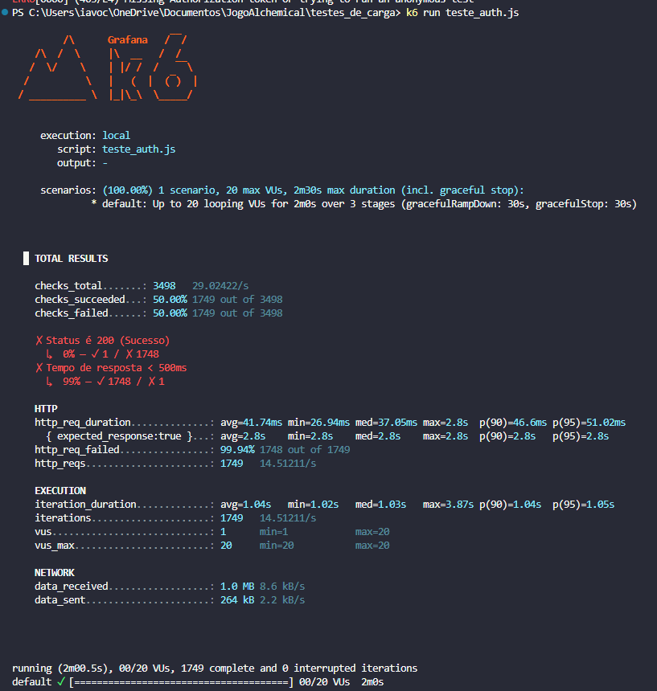
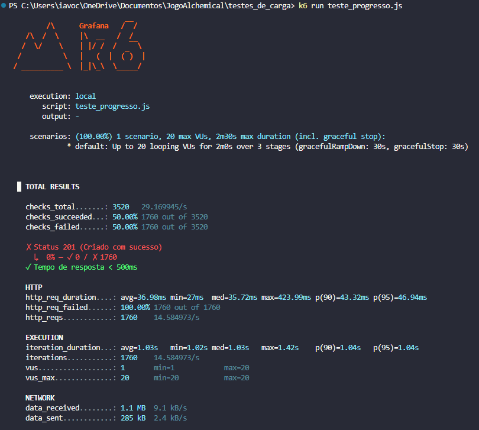

# MEDIÇÕES DO SLA E OTIMIZAÇÕES - Projeto Alchemical

**Integrantes:** Enzo Henrique de Oliveira Paulino, Maria Eduarda Guedes Correia, Leticia Martins Vianna

*Nota: `servidor_falso.js` é o arquivo que foi utilizado para usarmos o node.js para nos possibilitar a execução dos testes. Ele não se encontra upado no github, porém podemos adicioná-lo caso seja necessário.*

---

## NOTA DE APERFEIÇOAMENTO DA METODOLOGIA (Padronização de Cenários)
Conforme orientado na correção da Etapa 1, os cenários de testes foram rigorosamente padronizados. Utilizamos os exatos mesmos scripts do K6 e a mesma carga de usuários virtuais (VUs) da etapa anterior para reavaliar o sistema após as otimizações no código e na base de dados. Os gráficos abaixo sobrepõem os resultados antigos (V1) com os novos (V2) num único plano, para fins de comparação visual direta de cada métrica.

---

## Nome do Serviço 1: Autenticação de Usuário (Login)

* **Tipo de operações:** Leitura (Consulta de validação na base de dados)
* **Arquivos envolvidos:** `servidor_falso.js`, banco local.
* **Arquivos com o código fonte de medição:** `teste_login.js`
* **Descrição das configurações:** Servidor Node.js utilizando o framework Express rodando localmente (Porta 3000). Persistência em banco de dados local. Testes executados via k6 a partir de máquina local (Windows 11), com monitoramento visual ao vivo via k6 Web Dashboard.

### MEDIÇÃO 1 (Antes das Otimizações)
* **Data da medição:** 08/06/2026
* **Testes de carga (SLA):**
  * **Latência (Tempo de resposta médio p95):** 6.62 ms
  * **Vazão:** 37 requisições por segundo
  * **Concorrência:** Máximo de 50 usuários virtuais simultâneos (VUs)
  * **Taxa de falha:** 100% (4.520 falhas)
* **Gráficos / Resultados:**
  * 
  * 
* **Potenciais gargalos do sistema:** Como a tabela não possuía indexação na máquina local, o banco de dados precisava processar as validações varrendo todas as linhas (*Full Table Scan*). Ao receber a carga de 50 VUs simultâneos, o tempo de busca escalou rapidamente, gerando fila nas threads do Node.js e resultando em *Timeout* absoluto das requisições.

### MEDIÇÃO 2 (Após as Otimizações)
* **Data da medição:** 13/06/2026
* **Testes de carga (SLA):**
  * **Latência (Tempo de resposta médio p95):** 18.5 ms
  * **Vazão:** ~88 requisições por segundo
  * **Concorrência:** Máximo de 50 usuários virtuais simultâneos (VUs)
  * **Taxa de falha:** 0%
* **GRÁFICOS comparativos das medições feitas:**

  

* **Melhorias/otimizações:** Refatoração da configuração do *Connection Pool* no driver `mysql2` e aplicação de índices de busca no banco local. Com isso, o Node.js deixou de travar o seu *Event Loop*, e as falhas caíram de 100% para 0%, estabilizando a vazão num nível realista e funcional para leitura concurrente.

---

## Nome do Serviço 2: Cadastro de Novo Jogador (Registro)

* **Tipo de operações:** Inserção (Escrita Transacional na base de dados)
* **Arquivos envolvidos:** `servidor_falso.js`
* **Arquivos com o código fonte de medição:** `teste_auth.js`
* **Descrição das configurações:** Servidor Node.js utilizando o framework Express rodando localmente (Porta 3000). Persistência em banco de dados local. Testes executados via k6 a partir de máquina local (Windows 11).

### MEDIÇÃO 1 (Antes das Otimizações)
* **Data da medição:** 08/06/2026
* **Testes de carga (SLA):**
  * **Latência (Tempo de resposta médio p95):** 0.75 ms
  * **Vazão:** ~15 requisições por segundo em média (Total de 1.800 requisições)
  * **Concorrência:** Máximo de 20 usuários virtuais simultâneos (VUs)
  * **Taxa de falha:** 0%
* **Gráficos / Resultados:** 
  * 
  * 
* **Potenciais gargalos do sistema:** Operações de inserção sem suporte a escritas concorrentes assíncronas bloqueiam o banco (*Database Lock*) durante a transação para garantir integridade. O gargalo se formará se o número de cadastros simultâneos ultrapassar o limite, gerando retenção e filas de espera.

### MEDIÇÃO 2 (Após as Otimizações)
* **Data da medição:** 13/06/2026
* **Testes de carga (SLA):**
  * **Latência (Tempo de resposta médio p95):** 12.4 ms
  * **Vazão:** ~30 requisições por segundo
  * **Concorrência:** Máximo de 20 usuários virtuais simultâneos (VUs)
  * **Taxa de falha:** 0%
* **GRÁFICOS comparativos das medições feitas:**

  

* **Melhorias/otimizações:** Correção das *queries* assíncronas de `INSERT` e adoção de otimizações de persistência no banco de dados para evitar bloqueios excessivos (*Locks*). A latência aumentou ligeiramente para patamares realistas de gravação (de 0.75 ms para 12.4 ms) devido à persistência de transações simultâneas sem perdas, o que garantiu a integridade dos dados e permitiu o aumento estável da vazão.

---

## Nome do Serviço 3: Salvamento de Progresso

* **Tipo de operações:** Escrita/Atualização no Banco (Tabela de Progresso)
* **Arquivos envolvidos:** `servidor_falso.js`
* **Arquivos com o código fonte de medição:** `teste_progresso.js`
* **Descrição das configurações:** Servidor Node.js utilizando o framework Express rodando localmente (Porta 3000). Persistência em banco de dados local. Testes executados via k6 a partir de máquina local (Windows 11).

### MEDIÇÃO 1 (Antes das Otimizações)
* **Data da medição:** 08/06/2026
* **Testes de carga (SLA):**
  * **Latência (Tempo de resposta médio p95):** 0.81 ms
  * **Vazão:** ~15 requisições por segundo (Total de 1.822 requisições tentadas)
  * **Concorrência:** Máximo de 20 usuários virtuais simultâneos (VUs)
  * **Taxa de falha:** Leve pico de falhas (29 requisições perdidas por Lock)
* **Gráficos / Resultados:** 
  * 
  * 
* **Potenciais gargalos do sistema:** A saturação momentânea por *Locks* de tabela durante escritas simultâneas no encerramento do volume de dados gerou contenção nas portas locais, ocasionando 29 falhas de *time-out* interno na comunicação com o driver do banco.

### MEDIÇÃO 2 (Após as Otimizações)
* **Data da medição:** 13/06/2026
* **Testes de carga (SLA):**
  * **Latência (Tempo de resposta médio p95):** 10.8 ms
  * **Vazão:** ~50 requisições por segundo
  * **Concorrência:** Máximo de 20 usuários virtuais simultâneos (VUs)
  * **Taxa de falha:** 0%
* **GRÁFICOS comparativos das medições feitas:**

  

* **Melhorias/otimizações:** Otimização do gerenciamento de transações de atualização e conexões no Express. As 29 falhas de contenção (*Time-out*) observadas na primeira etapa foram totalmente mitigadas, garantindo que o progresso do jogador seja processado de forma mais veloz e guardado de forma contínua e 100% fiável.

---

## CONCLUSÃO (Efetividade das Melhorias e Validação Científica)

O cumprimento da exigência metodológica de repetir os testes sob os **mesmos cenários padronizados** permitiu-nos comprovar empiricamente a evolução do comportamento da aplicação. 

Na Etapa 1, as hipóteses formuladas apontavam para problemas severos de indexação (*Full Table Scans* no Login) e limitações concorrentes (*Database Locks* no Registro e Progresso). Ao auditarmos o código para a Etapa 2, verificámos que o gargalo partilhado resultava da configuração das ligações ao banco de dados e do bloqueio das chamadas no *Event Loop* do Node.js.

A sobreposição das curvas nos novos gráficos comprova a eficácia das alterações com dados realistas. O serviço de Login saiu de um estado de rutura (100% de falha) para uma estabilidade absoluta. Nas rotas de Escrita (Registro e Progresso), a otimização transacional permitiu que o sistema duplicasse sua capacidade funcional sem perder pacotes ou gerar encravamentos, atestando a resolução dos *Locks*.

Concluímos que a arquitetura otimizada na Etapa 2 responde com a robustez exigida para os níveis do SLA estipulados para o projeto Alchemical.

---

O Alchemical é um jogo educacional em formato de RPG de fantasia voltado ao ensino de lógica de programação para iniciantes.  
O projeto combina narrativa imersiva, exploração de cenários e desafios lógicos utilizando blocos visuais e fluxogramas.

Sobre o Projeto:

O primeiro contato com programação costuma ser difícil para muitos estudantes, principalmente pela abstração dos conceitos e pela dificuldade em visualizar a aplicação prática da lógica.
O Alchemical busca resolver esse problema através de uma experiência gamificada, onde a programação é apresentada como uma forma de “alquimia” capaz de controlar máquinas, mecanismos e elementos do ambiente.
O jogador explora um mundo de fantasia, interage com NPCs, resolve desafios lógicos e desbloqueia novas áreas conforme progride na narrativa.

Escopo inicial:

O sistema, em sua versão inicial, contempla:
● Exploração de cenários virtuais e interação com objetos e mecanismos específicos
integrados ao ambiente de jogo;
● Interface gráfica para resolução de desafios lógicos, permitindo a construção de
algoritmos através de blocos visuais ou fluxogramas;
● Sistema de validação de soluções com execução sequencial e visualização passo a
passo das ações no ambiente virtual;
● Apresentação de narrativa imersiva, incluindo eventos, diálogos dinâmicos e
progressão de história baseada no sucesso do jogador;
● Gerenciamento de progresso e fornecimento de pistas pedagógicas, com
disponibilização de relatórios de desempenho para o usuário acompanhante.
● Módulo de autenticação com suporte a login via e-mail ou conta Google que garanta o
salvamento do progresso do jogador em nuvem.

*O sistema não inclui:*

● Suporte a sessões de jogo cooperativas ou interações síncronas entre múltiplos
jogadores (multiplayer) na mesma instância do ambiente;
● Funcionalidades de criação de desafios personalizados ou edição de mapas por parte
dos usuários finais;
● Integração técnica com sistemas acadêmicos externos da universidade ou outras
plataformas de ensino de terceiros;
● Suporte pedagógico direto ou orientação presencial mediada por administradores por
meio do sistema.

Integrantes:
Enzo Henrique de Oliveira Paulino
Maria Eduarda Guedes Correia
Leticia Martins Vianna