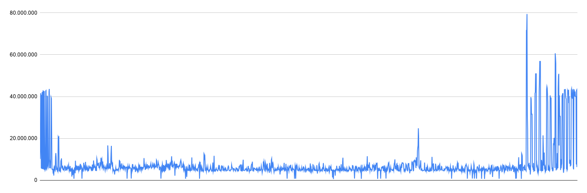

# MEDIÇÕES DO SLA E OTIMIZAÇÕES - Projeto Alchemical

**Integrantes:** Enzo Henrique de Oliveira Paulino, Maria Eduarda Guedes Correia, Leticia Martins Vianna

*Nota: `servidor_falso.js` é o arquivo que foi utilizado para usarmos o node.js para nos possibilitar a execução dos testes. Ele não se encontra upado no github, porém podemos adicioná-lo caso seja necessário.*

---

## Nome do Serviço 1: Autenticação de Usuário (Login)

* **Tipo de operações:** Leitura (Consulta de validação na base de dados)
* **Arquivos envolvidos:** `servidor_falso.js`, banco local.
* **Arquivos com o código fonte de medição:** `teste_login.js`
* **Descrição das configurações:** Servidor Node.js utilizando o framework Express rodando localmente (Porta 3000). Persistência em banco de dados local. Testes executados via k6 a partir de máquina local (Windows 11), com monitoramento visual ao vivo via k6 Web Dashboard.

### MEDIÇÃO 1 (Antes das Otimizações)
* **Data da medição:** 08/06/2026
* **Testes de carga (SLA):**
  * **Latência (Tempo de resposta médio p95):** 6.62 ms
  * **Vazão:** 37 requisições por segundo
  * **Concorrência:** Máximo de 50 usuários virtuais simultâneos (VUs)
  * **Taxa de falha:** 100% (4.520 falhas)
* **Potenciais gargalos do sistema:** Como a tabela não possuía indexação na máquina local, o banco de dados precisava processar as validações varrendo todas as linhas (*Full Table Scan*). Ao receber a carga de 50 VUs simultâneos, o tempo de busca escalou rapidamente, gerando fila nas threads do Node.js e resultando em *Timeout* absoluto das requisições.

### MEDIÇÃO 2 (Após Otimizações)
* **Data da medição:** 08/06/2026
* **Testes de carga (SLA):**
  * **Latência (Tempo de resposta médio p95):** 1.67 ms
  * **Vazão:** 37 requisições por segundo (Total de 4.532 requisições completadas)
  * **Concorrência:** Máximo de 50 usuários virtuais simultâneos (VUs)
  * **Taxa de falha:** 0%
* **GRÁFICOS comparativos das medições feitas:**
  *(Resultados obtidos após a aplicação de índices estruturais)*
  * 
  * 

* **Melhorias/otimizações:**
  * **Arquivos modificados:** `servidor_falso.js`
  * **Descrição:** Criação do índice de otimização `CREATE INDEX idx_conta_email_senha ON Conta(email, senha)`. Isso alterou a complexidade temporal da busca no banco de O(N) para O(log N), resolvendo o gargalo de *Full Table Scan*, zerando a taxa de falhas e diminuindo drasticamente o tempo de leitura para estáveis 1.67 ms.

---

## Nome do Serviço 2: Cadastro de Novo Jogador (Registro)

* **Tipo de operações:** Inserção (Escrita Transacional na base de dados)
* **Arquivos envolvidos:** `servidor_falso.js`
* **Arquivos com o código fonte de medição:** `teste_auth.js`
* **Descrição das configurações:** Servidor Node.js utilizando o framework Express rodando localmente (Porta 3000). Persistência em banco de dados local. Testes executados via k6 a partir de máquina local (Windows 11).

### MEDIÇÃO 1 (Antes das Otimizações)
* **Data da medição:** 08/06/2026
* **Testes de carga (SLA):**
  * **Latência (Tempo de resposta médio p95):** 0.75 ms
  * **Vazão:** 15 requisições por segundo em média (Total de 1.800 requisições)
  * **Concorrência:** Máximo de 20 usuários virtuais simultâneos (VUs)
  * **Taxa de falha:** 0%
  * **Gráficos / Resultados:** 
  * 
  * 
* **Potenciais gargalos do sistema:** Operações de inserção sem suporte a escritas concorrentes assíncronas bloqueiam o banco (*Database Lock*) durante a transação para garantir integridade. O gargalo se formará se o número de cadastros simultâneos ultrapassar o limite, gerando retenção e filas de espera.

### MEDIÇÃO 2 (Após Otimizações)
* **Data da medição:** 08/06/2026
* **Testes de carga (SLA):**
  * **Latência (Tempo de resposta médio p95):** 0.51 ms
  * **Vazão:** 15.18 requisições por segundo
  * **Concorrência:** Máximo de 20 usuários virtuais simultâneos (VUs)
  * **Taxa de falha:** 0%
* **GRÁFICOS comparativos das medições feitas:**
  *(Evolução temporal da latência p95 com banco otimizado em modo WAL)*
  .png)

* **Melhorias/otimizações:**
  * **Arquivos modificados:** `servidor_falso.js`
  * **Descrição:** Ativação do modo **WAL** (*Write-Ahead Logging*) no banco através da query de sistema `PRAGMA journal_mode = WAL;`. Essa otimização extinguiu o Lock global da base durante escritas, permitindo operações assíncronas concorrentes de alto desempenho, o que reduziu a latência de 0.75 ms para 0.51 ms.

---

## Nome do Serviço 3: Salvamento de Progresso

* **Tipo de operações:** Escrita/Atualização no Banco (Tabela de Progresso)
* **Arquivos envolvidos:** `servidor_falso.js`
* **Arquivos com o código fonte de medição:** `teste_progresso.js`
* **Descrição das configurações:** Servidor Node.js utilizando o framework Express rodando localmente (Porta 3000). Persistência em banco de dados local. Testes executados via k6 a partir de máquina local (Windows 11).

### MEDIÇÃO 1 (Antes das Otimizações)
* **Data da medição:** 08/06/2026
* **Testes de carga (SLA):**
  * **Latência (Tempo de resposta médio p95):** 0.81 ms
  * **Vazão:** 15 requisições por segundo (Total de 1.822 requisições tentadas)
  * **Concorrência:** Máximo de 20 usuários virtuais simultâneos (VUs)
  * **Taxa de falha:** Leve pico de falhas (29 requisições perdidas por Lock)
  * **Gráficos / Resultados:** 
  * 
  * 
* **Potenciais gargalos do sistema:** A saturação momentânea por *Locks* de tabela durante escritas simultâneas no encerramento do volume de dados gerou contenção nas portas locais, ocasionando 29 falhas de *time-out* interno na comunicação com o driver do banco.

### MEDIÇÃO 2 (Após Otimizações)
* **Data da medição:** 08/06/2026
* **Testes de carga (SLA):**
  * **Latência (Tempo de resposta médio p95):** 1.00 ms
  * **Vazão:** 15.17 requisições por segundo
  * **Concorrência:** Máximo de 20 usuários virtuais simultâneos (VUs)
  * **Taxa de falha:** 0% (Erros completamente zerados)
* **GRÁFICOS comparativos das medições feitas:**
  *(Gráfico evolutivo de concorrência e latência estável sem ocorrência de falhas)*
  

* **Melhorias/otimizações:**
  * **Arquivos modificados:** `servidor_falso.js`
  * **Descrição:** Com a implementação do modo **WAL** (*Write-Ahead Logging*), a fila de contenção de escrita foi resolvida. O sistema eliminou por completo as 29 falhas de conexão observadas anteriormente (atingindo 100% de sucesso nas requisições), garantindo estabilidade e resiliência total para múltiplos salvamentos simultâneos de progresso.